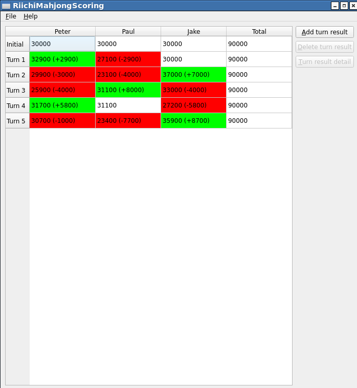
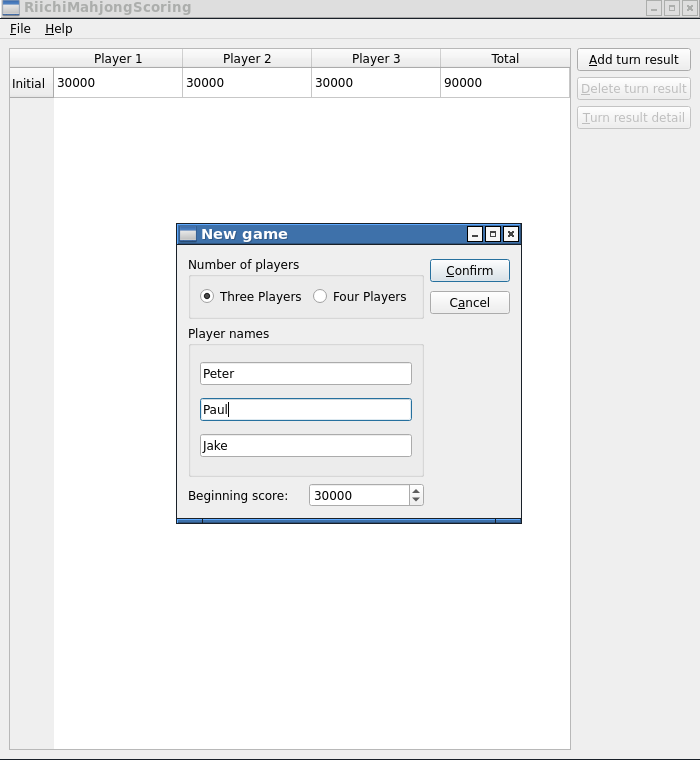
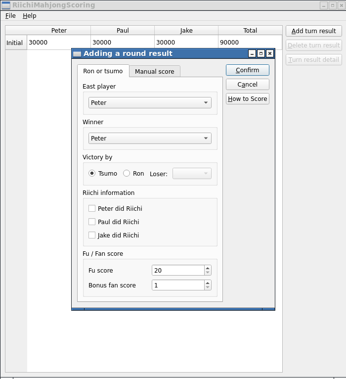
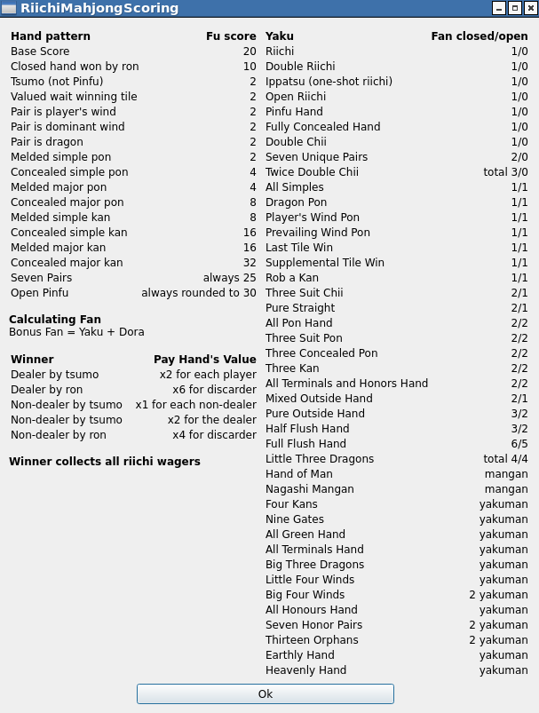

# RiichiMahjongScoring

A Riichi Mahjong scoresheet software based on Scott D. Miller's book scoring tutorial, coded in C++ and Qt5

## Functionalities

This program allows the user to:

- create a scoresheet with customized player names, for three or four players
- add turn results and compute score changes
- save the current scoresheet to a file
- load a saved scoresheet

## Requirements

This project requires:

- CMake version >= 3.1
- Qt5

## Building

On Linux, go into the project directory and execute the following commands:

```bash
mkdir -p build
cd build
cmake ..
make
```

The generated executable program is located in `build/RiichiMahjongScoring`.

## Screenshots









